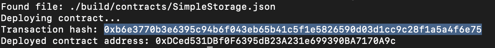

# Task 2

1. A screenshot of the console output immediately after you have successfully deployed a smart contract.

2. The transaction hash from the contract deployment (in text format)
    
   `0xb6e3770b3e6395c94b6f043eb65b41c5f1e5826590d03d1cc9c28f1a5a4f6e75`

3. The deployed contract address from the contract deployment (in text format).
    
   `0xDCed531DBf0F6395dB23A231e699390BA7170A9c`
