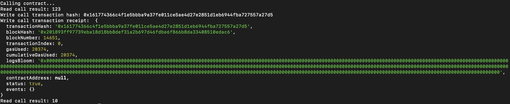

# Task 3

1. A screenshot of the console output immediately after you have successfully issued a smart contract call.



2. The transaction hash from the console output (in text format).

   `0x161774366c4f1e5bbba9a37fe011ce5ae4d27e2851d1eb6944fba727557a27d5`

3. The contract address that you called (in text format).

   `0xDCed531DBf0F6395dB23A231e699390BA7170A9c`

4. The ABI for contract you made a call on (in text format).

```
   [
      {
         "inputs": [],
         "stateMutability": "payable",
         "type": "constructor"
      },
      {
         "inputs": [
            {
               "internalType": "uint256",
               "name": "x",
               "type": "uint256"
            }
         ],
         "name": "set",
         "outputs": [],
         "stateMutability": "payable",
         "type": "function"
      },
      {
         "inputs": [],
         "name": "get",
         "outputs": [
            {
               "internalType": "uint256",
               "name": "",
               "type": "uint256"
            }
         ],
         "stateMutability": "view",
         "type": "function"
      }
   ]
```
